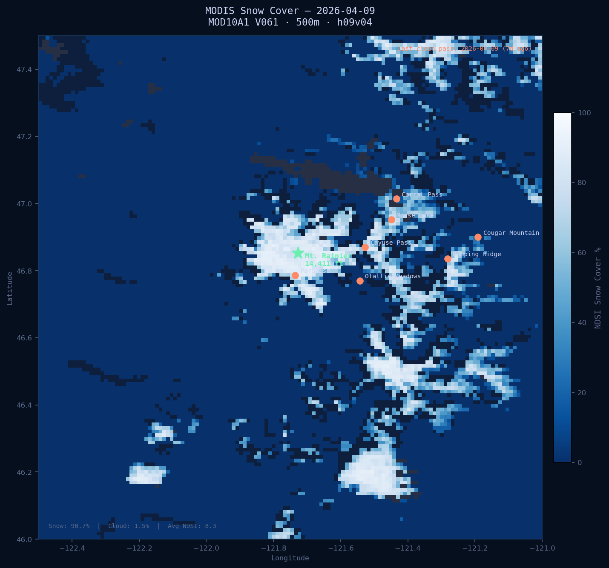

# ❄️ STORM CHASER: RAINIER
### *"You don't chase the mountain. The mountain chases you."*

<div align="center">



**[ 🔴 LIVE DASHBOARD → bdgroves.github.io/rainier-snowpack ](https://bdgroves.github.io/rainier-snowpack/)**

*Real-time snowpack intelligence. Ground sensors. Satellite eyes. Zero mercy.*

---


</div>

---

## 🌩️ WHAT WE'RE CHASING

Mt. Rainier holds **more glacial ice than any other peak in the contiguous United States**. The snowpack surrounding its flanks feeds rivers, threatens valleys, and changes without warning. Every inch of SWE matters.

This system tracks it. All of it. Every hour. From space and from the ground.

> *"It's not about the data. It's about what the data is about to do."*

---

## 📡 THE RIG

Three sensor networks. One pipeline. No days off.

### 🔩 Ground Truth — NRCS SNOTEL
*Seven instruments bolted into the Cascades. Measuring what satellites can't feel.*

| Station | Elevation | What It Watches |
|---|---|---|
| **Corral Pass** | 5,810 ft | Highest sensor. First to know. |
| **Morse Lake** | 5,400 ft | Consistently leads basin SWE |
| **Cayuse Pass** | 5,260 ft | SR-410 corridor sentinel |
| **Paradise** | 5,150 ft | The mountain's heartbeat |
| **Bumping Ridge** | 4,600 ft | Eastern slope indicator |
| **Olallie Meadows** | 4,010 ft | Mid-elevation transition zone |
| **Cougar Mountain** | 3,210 ft | Low-elevation canary — first to melt |

Every hour: **SWE · Snow Depth · Temperature · Precipitation**

### 🛰️ Eyes From Space — NASA MODIS Terra
*500 meters per pixel. Daily overpass. 72% snow cover and counting.*

```
Collection:  MOD10A1 V061
Concept ID:  C2565093311-NSIDC_CPRD
Tile:        h09v04  (Pacific Northwest)
Resolution:  500m per pixel · Daily
Projection:  Sinusoidal → WGS84 (EPSG:4326)
Auth:        NASA Earthdata bearer token
```

When it's cloudy? The system searches back through the last 14 days and holds the last clean pass. It never shows you a lie.

### 📷 Live Webcam — NPS Paradise
*Jackson Visitor Center, 5,400 ft. Refreshes every 60 seconds. Is the mountain out?*

Six angles, all live: **Visitor Center · Mountain · East · West · Tatoosh Range · Longmire**

Public NPS JPEG feeds. No auth. No delay. Just the mountain, right now.

---

## ⚡ THE PIPELINE

```
Every hour, on the hour, without fail:

  fetch          →  7 SNOTEL stations via NRCS AWDB REST API (httpx)
                    SWE · depth · temp · precip · 24hr change ·
                    days since snow · melt alert
  fetch-hourly   →  48-hour diurnal temperature sweep
  fetch-modis    →  NASA Earthdata CMR search → HDF4 download →
                    sinusoidal reproject → cloud quality check →
                    fallback to last clean pass if >80% cloud cover
  analyze        →  R · tidyverse · ggplot2 · basin statistics
  deploy         →  commit → push → GitHub Pages live
```

**Triggered by:** `cron: "0 * * * *"` — GitHub Actions, hourly, forever.

No human required. No button to push. Just data, moving.

> If all stations return no data, the pipeline exits with code 1 and preserves
> the last known good JSON. Zeroes never reach the dashboard.

---

## 🖥️ THE DASHBOARD

Nine panels. One story.

| Panel | Signal |
|---|---|
| **Core KPI Strip** | Basin SWE · avg depth · peak SWE · avg temperature · stations freezing |
| **Snow Event KPIs** | 24hr new snow · days since last snowfall · melt rate alert |
| **SWE Time Series** | Water Year 2026, daily basin average |
| **Station Cards** | Per-station SWE, depth, temp + 24hr SWE change inline |
| **Elevation Ladder** | SWE ranked high → low by elevation |
| **Temperature List** | Current temps, coldest first, hourly data |
| **48-Hour Diurnal** | Freeze/thaw cycles across all 7 stations |
| **Live Webcam** | NPS Paradise · 6 cam angles · 60s auto-refresh |
| **MODIS Satellite Map** | NASA snow cover with cloud fallback annotation |

### Snow Event KPIs — how they work

**New Snow · 24hr** — basin avg SWE change since yesterday. Blue when accumulating, orange when losing ground.

**Last Snowfall** — days since any station recorded measurable new snow. Green when ≤1 day, orange at 7+ days dry.

**Melt Rate** — watches for rapid SWE loss. Flips to `🔴 Alert` with pulsing red border if any station drops >0.5" SWE in 24 hours.

---

## 🗂️ REPO STRUCTURE

```
rainier-snowpack/
├── src/
│   ├── python/
│   │   ├── fetch_snotel.py       # Ground truth — 7 stations + snow event metrics
│   │   ├── fetch_hourly.py       # 48hr diurnal temperature
│   │   └── fetch_modis.py        # Satellite — 14-day cloud fallback logic
│   └── r/
│       └── snowpack_stats.R      # Basin stats + ggplot2 charts
├── data/processed/               # Live data feeds
│   ├── snotel_latest.json        # Stations + basin metrics incl. snow events
│   ├── basin_daily.csv
│   ├── hourly_temps.json
│   └── modis/modis_latest.json
├── dashboard/                    # Served by GitHub Pages
├── outputs/                      # Generated PNGs
├── .github/workflows/
│   └── daily_update.yml          # The engine
├── index.html                    # The face
└── pixi.toml                     # The bones
```

---

## 🔧 DEPLOY YOUR OWN RIG

### What you need
- [pixi](https://prefix.dev) — environment manager
- [NASA Earthdata account](https://urs.earthdata.nasa.gov/users/new) — free
- A mountain worth watching

### Stand it up
```bash
git clone git@github.com:bdgroves/rainier-snowpack.git
cd rainier-snowpack
pixi install
```

### Credentials
```
# ~/.netrc  (Linux/Mac)  or  C:\Users\<you>\_netrc  (Windows)
machine urs.earthdata.nasa.gov
login    YOUR_USERNAME
password YOUR_PASSWORD
```

Get your bearer token: **urs.earthdata.nasa.gov → My Profile → Generate Token**

### Run it
```bash
pixi run update          # Full pipeline
pixi run fetch           # SNOTEL only
pixi run fetch-hourly    # 48hr temperature only
pixi run fetch-modis     # Satellite only
pixi run analyze         # R stats + charts
```

### GitHub Actions secrets required

| Secret | Value |
|---|---|
| `EARTHDATA_USERNAME` | Your NASA username |
| `EARTHDATA_PASSWORD` | Your NASA password |
| `EARTHDATA_TOKEN` | Long-lived bearer token from NASA |

---

## 🌡️ READING THE SIGNS

### NDSI Snow Cover pixel values (MOD10A1)

| Value | Meaning |
|---|---|
| **0 – 100** | Snow cover % — 100 is dense continuous pack |
| **200** | Missing data |
| **237** | Inland water |
| **250** | ☁️ Cloud obscured — triggers 14-day fallback |
| **255** | Fill / no data |

*Watershed clip:* `(-122.5°W, 46.0°N) → (-121.0°W, 47.5°N)`

---

## 📊 CURRENT CONDITIONS — WY2026

*As of early March 2026 — fresh snow on a hard refreeze.*

```
Basin avg SWE  ████████████░░░░  17.2"   +0.17" overnight · snowing today
Morse Lake     ████████████████  26.2"   season high
Paradise       ███████████████░  25.3"   +0.30" · 27.5°F
Cayuse Pass    █████████████░░░  21.9"   +0.30" · 28.6°F
Corral Pass    ███████████░░░░░  18.3"   +0.10" · 30.2°F
Bumping Ridge  ███████░░░░░░░░░  11.8"   +0.10" · 29.5°F
Olallie Mdws   █████████░░░░░░░  15.9"   +0.30" · 31.6°F
Cougar Mtn     ░░░░░░░░░░░░░░░░   0.8"   +0.10" · 33.8°F

Satellite:     72% snow cover · 2.2% cloud · NDSI avg 27.1
               (March 2nd clean pass — clouds blocked 3rd & 4th)
Webcam:        Jackson Visitor Center · Paradise · Live · 60s refresh
48hr freeze:   33 hours avg across all stations
```

---

## ⚙️ STACK

```
Ground data   →  Python · httpx · NRCS AWDB REST API
Satellite     →  rasterio · libgdal-hdf4 · NASA Earthdata
Statistics    →  R · tidyverse · zoo · ggplot2
Dashboard     →  Vanilla JS · Chart.js · CSS Grid
Webcam        →  NPS public JPEG feed · 6 angles · 60s auto-refresh
Pipeline      →  GitHub Actions · pixi · hourly cron
Hosting       →  GitHub Pages
```

---

<div align="center">

*Built for the mountain. Run by the hour. Watching so you don't have to.*

**46.8523°N · 121.7269°W · 14,411 ft**

*MIT License · Data: NRCS public domain · NASA Earthdata open access · NPS public webcams*

</div>
