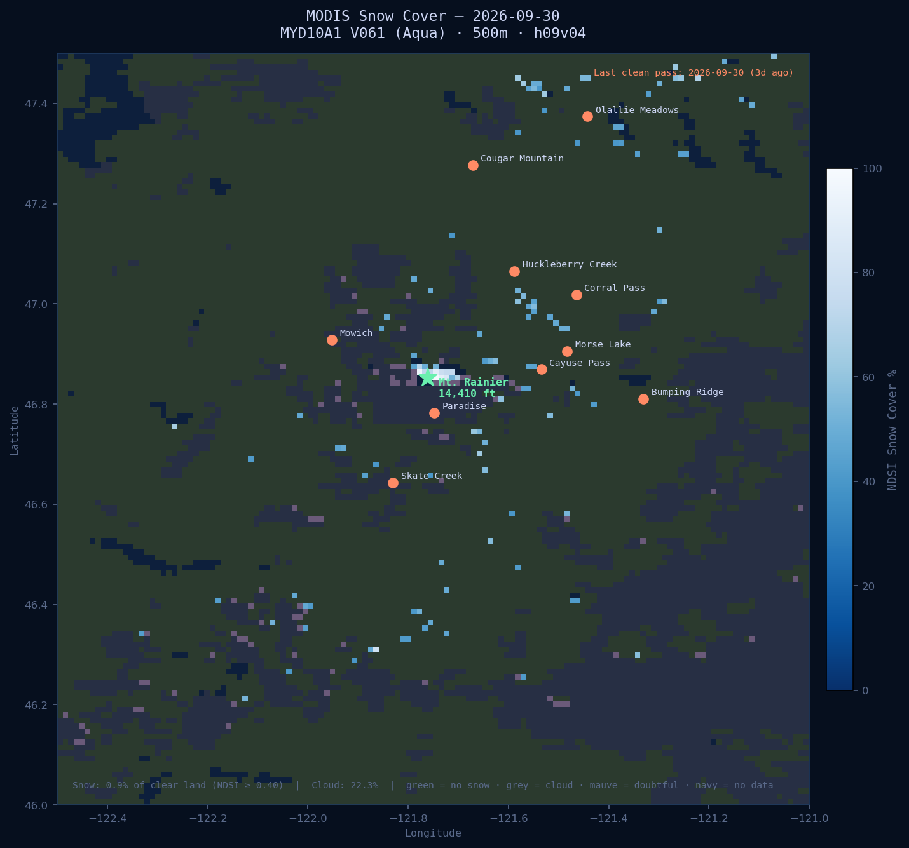

# ❄️ STORM CHASER: RAINIER
### *"You don't chase the mountain. The mountain chases you."*

<div align="center">



**[ 🔴 LIVE DASHBOARD → bdgroves.github.io/rainier-snowpack ](https://bdgroves.github.io/rainier-snowpack/)**

*Real-time snowpack intelligence. Ground sensors. Satellite eyes. Zero mercy.*

---


</div>

---

## 🌩️ WHAT WE'RE CHASING

Mt. Rainier holds **more glacial ice than any other peak in the contiguous United States**. The snowpack surrounding its flanks feeds rivers, threatens valleys, and changes without warning. Every inch of SWE matters.

This system tracks it. All of it. Every hour. From space and from the ground.

> *"It's not about the data. It's about what the data is about to do."*

---

## 📡 THE RIG

Three sensor networks. One pipeline. No days off.

### 🔩 Ground Truth — NRCS SNOTEL
*Ten instruments bolted into the Cascades. Every number read against its own normal.*

| Station | Elevation | Group | What It Watches |
|---|---|---|---|
| **Corral Pass** | 5,810 ft | Rainier | Highest sensor. First to know. |
| **Morse Lake** | 5,400 ft | Rainier | Crest above Chinook Pass |
| **Cayuse Pass** | 5,260 ft | Rainier | SR-410 corridor sentinel |
| **Paradise** | 5,150 ft | Rainier | The mountain's heartbeat — record back to 1981 |
| **Bumping Ridge** | 4,600 ft | Rainier | East-slope rain shadow |
| **Skate Creek** | 3,770 ft | Rainier | South side, above Packwood |
| **Mowich** | 3,170 ft | Rainier | Northwest flank — the rain/snow line |
| **Huckleberry Creek** | 2,250 ft | Rainier | Lowest sensor. Snow here means a cold storm. |
| **Olallie Meadows** | 4,010 ft | Regional | Snoqualmie Pass — kept from the original seven |
| **Cougar Mountain** | 3,210 ft | Regional | Cedar River watershed — kept from the original seven |

**The Rainier index** is Σ SWE ÷ Σ median over the Rainier stations reporting both (NRCS 1991–2020 medians), so one missing station can't move it. % of median waits until the median itself passes 1″.

Daily: **SWE · depth · temperature · precipitation since Oct 1 · medians · last year** · Hourly: **temperature → freezing level**

### 📜 The Long Record
*Every complete water year since 1979, rebuilt weekly.*

April 1 SWE, peak SWE and date, snow onset and melt-out per station; percentile bands for every day of the year; and NOAA's Oceanic Niño Index for each winter, so the page can say what El Niño and La Niña winters have actually meant on Rainier. NOAA CPC's current ENSO outlook is quoted every run.

### 🛰️ Eyes From Space — NASA MODIS + ESA Sentinel-2
*500 meters per pixel, daily. 10 meters, when the clouds part.*

```
MODIS:       MOD10A1 V061 (Terra), MYD10A1 V061 (Aqua) as backup · tile h09v04
Snow:        NDSI ≥ 0.40, as % of the clear land seen that day — wider area and the park;
             snow touching cloud, or with NSIDC 'poor' QA, is set aside as doubtful
Auth:        Earthdata token; refreshed from username/password when it expires
Sentinel-2:  L2A true colour, same-day tiles mosaicked over the mountain, < 30% cloud
             (Microsoft Planetary Computer, windowed reads — no full-tile downloads)
```

When it's cloudy, the system searches back 14 days (MODIS) or 30 days (Sentinel-2) and says how old the image is. It never shows you a lie.

### 📷 Live Webcam — NPS Paradise
*Jackson Visitor Center, 5,400 ft. Refreshes every 60 seconds. Is the mountain out?*

Six angles, all live: **Visitor Center · Mountain · East · West · Tatoosh Range · Longmire**

Public NPS JPEG feeds. No auth. No delay. Just the mountain, right now.

---

## ⚡ THE PIPELINE

```
Every hour:

  fetch          →  10 SNOTEL stations, NRCS AWDB REST API, with medians + last year
  fetch-hourly   →  48 h temperatures on one hourly axis → freezing level
  fetch-history  →  every water year since 1979 + ONI + CPC outlook (rebuilt weekly)
  fetch-gauges   →  4 rivers, USGS Water Data API (WaterServices fallback)
  fetch-modis    →  NASA MODIS snow cover, 14-day cloud fallback
  fetch-sentinel →  Sentinel-2 true colour
  analyze        →  R · season summary + static plots (outputs/, not committed)
  commit         →  every 3 hours, or straight away when the daily data moves or a river jumps
```

**Triggered by:** `cron: "0 * * * *"` — GitHub Actions, hourly, forever.

> Every fetcher keeps the last good file if its source fails, and a failing step
> writes its last lines as an annotation on the run. On Oct 1 — day one of a new
> water year — there are no readings yet; the page says so instead of showing zeros.

---

## 🖥️ THE DASHBOARD

| Section | Signal |
|---|---|
| **Now** | Rainier % of median · precipitation since Oct 1 · freezing level · El Niño/La Niña |
| **Snow events** | 24 h SWE and depth change · last snow day · melt watch · density |
| **Season vs normal** | This year, the median, last year — and for any station, its full record range |
| **Stations** | Ten cards with real sparklines; click one to chart it · SWE by elevation vs median |
| **History & El Niño** | April 1 / peak / melt-out by year, coloured by ENSO phase, with trend · last winter in review |
| **Freezing level** | 48 h temperatures by station and the estimated 32 °F level |
| **Eyes on the mountain** | NPS webcams · MODIS · Sentinel-2 · NASA GIBS live map |
| **Rivers** | Nisqually, Mineral Creek, Puyallup, White — 7 days hourly |
| **Data freshness** | How old every feed is |

### Reading the snow events

**SWE change · 24 h** — Rainier stations' average. Blue when adding water, orange when losing it.

**Last snow day** — a station's depth rose 2″, or its SWE rose 0.2″ without the depth falling. (Rain doesn't count — the old version counted any precipitation.)

**Melt watch** — `Alert` with a pulsing red border if any station loses more than 0.5″ of SWE in a day.

**Warm vs dry snow drought** — when the snowpack is under 75% of median, the page checks precipitation: near normal means the storms came warm (rain, or melt); low means they didn't come.

---

## 🗂️ REPO STRUCTURE

```
rainier-snowpack/
├── src/python/
│   ├── stations.py           # The ten stations — one list for every script
│   ├── fetch_snotel.py       # Daily data, medians, Rainier index
│   ├── fetch_hourly.py       # 48 h temperatures + freezing level
│   ├── fetch_history.py      # Every water year since 1979 + ENSO
│   ├── fetch_gauges.py       # USGS rivers
│   ├── fetch_modis.py        # MODIS snow cover
│   └── fetch_sentinel.py     # Sentinel-2 true colour
├── src/r/snowpack_stats.R    # Season summary + static plots
├── data/processed/           # What the page reads
│   ├── snotel_latest.json    # Current conditions + Rainier index
│   ├── snotel_season.json    # Season chart data: this year, median, last year
│   ├── snotel_daily.csv      # Every station, every day, this water year
│   ├── basin_daily.csv       # Rainier index by day
│   ├── snow_history.json     # The long record + ENSO
│   ├── hourly_temps.json · gauges_latest.json · sentinel_latest.json · modis/
├── data/archive/             # snotel_wyYYYY.csv — each finished water year
├── data/modis_archive/ · data/sentinel_archive/
├── dashboard/                # Images the page shows (MODIS map, Sentinel-2)
├── .github/workflows/daily_update.yml
├── index.html
└── pixi.toml
```

---

## 🔧 DEPLOY YOUR OWN RIG

### What you need
- [pixi](https://prefix.dev) — environment manager
- [NASA Earthdata account](https://urs.earthdata.nasa.gov/users/new) — free
- A mountain worth watching

### Stand it up
```bash
git clone git@github.com:bdgroves/rainier-snowpack.git
cd rainier-snowpack
pixi install
```

### Credentials
```
# ~/.netrc  (Linux/Mac)  or  C:\Users\<you>\_netrc  (Windows)
machine urs.earthdata.nasa.gov
login    YOUR_USERNAME
password YOUR_PASSWORD
```

Get your bearer token: **urs.earthdata.nasa.gov → My Profile → Generate Token**

### Run it
```bash
pixi run update          # Full pipeline
pixi run fetch           # SNOTEL only
pixi run fetch-hourly    # 48 h temperature + freezing level
pixi run fetch-history   # The long record + ENSO
pixi run fetch-gauges    # Rivers
pixi run fetch-modis     # MODIS
pixi run fetch-sentinel  # Sentinel-2
pixi run analyze         # R summary + plots (to outputs/)
```

### GitHub Actions secrets required

| Secret | Value |
|---|---|
| `EARTHDATA_USERNAME` | Your NASA username |
| `EARTHDATA_PASSWORD` | Your NASA password |
| `EARTHDATA_TOKEN` | Bearer token from NASA (expires after 60 days; the script gets a fresh one from the username/password when it does) |
| `USGS_API_KEY` | Optional — api.waterdata.usgs.gov key for a higher rate limit |

---

## 🌡️ READING THE SIGNS

### NDSI Snow Cover pixel values (MOD10A1)

| Value | Meaning |
|---|---|
| **0 – 100** | NDSI × 100 for clear land. **≥ 40 counts as snow** (NSIDC's looser 10 showed snow in bare forest in late Sept 2026). |
| **200 / 201** | Missing / no decision |
| **211** | Night |
| **237 / 239** | Inland water / ocean |
| **250** | ☁️ Cloud — excluded from the snow %, and triggers the 14-day fallback |
| **254 / 255** | Saturated / fill |

*Wider area:* `(-122.5°W, 46.0°N) → (-121.0°W, 47.5°N)` · *Park:* `(-121.92°W, 46.73°N) → (-121.45°W, 47.01°N)`

---

## 📊 LAST WINTER — WY2026

```
Rainier April 1 index   63% of median   5th lowest of 46 winters (2015: 25%)
Paradise April 1        37.8"           1981–2026 median 68.4" · 4th lowest
Paradise peak           38.7" Apr 23    median peak 81.6" around May 4
Paradise melt-out       Jun 15          30 days earlier than the median (Jul 15)
```

And the winter ahead: NOAA CPC issued an **El Niño Advisory** on 10 September 2026 —
"El Niño is strengthening, with a greater than 90% chance of a very strong event."
The page keeps that quote current and sets it against the record.

---

## ⚙️ STACK

```
Ground data   →  Python · requests · NRCS AWDB REST API (+ medians)
History/ENSO  →  NRCS daily record since 1979 · NOAA CPC ONI + outlook
Rivers        →  USGS Water Data API
Satellite     →  rasterio · libgdal-hdf4 · NASA Earthdata · Planetary Computer STAC
Statistics    →  R · tidyverse · zoo · ggplot2
Dashboard     →  Vanilla JS · Chart.js · Leaflet + NASA GIBS · CSS Grid
Webcam        →  NPS public JPEG feed · 6 angles · 60s auto-refresh
Pipeline      →  GitHub Actions · pixi · hourly cron
Hosting       →  GitHub Pages
```

---

<div align="center">

*Built for the mountain. Run by the hour. Watching so you don't have to.*

**46.8523°N · 121.7603°W · 14,410 ft**

*MIT License · Data: NRCS public domain · NASA Earthdata open access · NPS public webcams*

</div>
